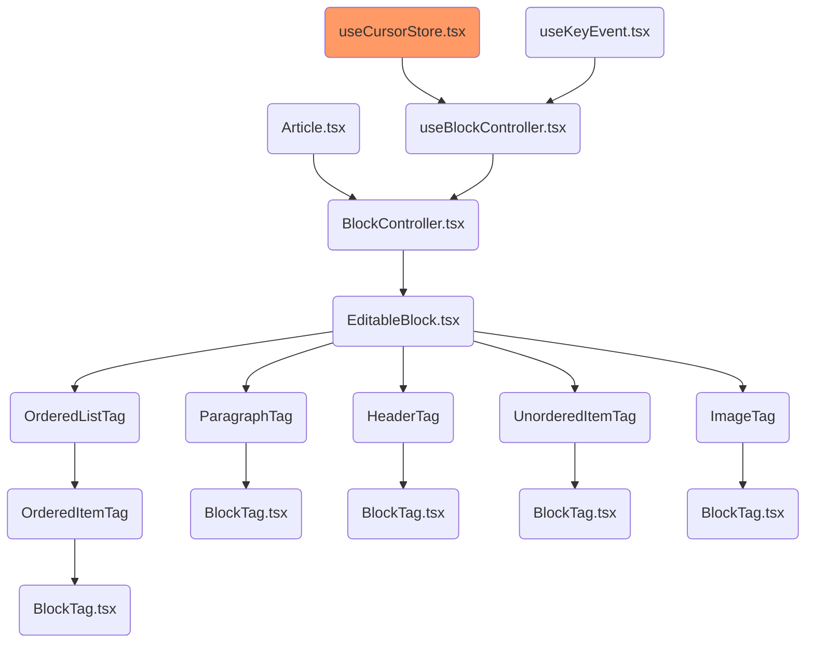
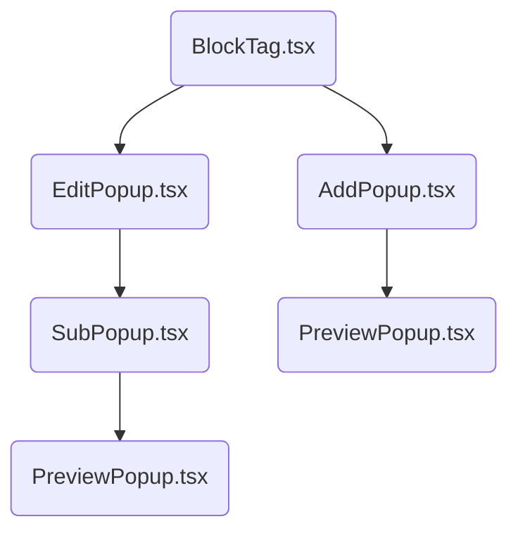

# NOTION_TEAM_02

|                    [슈니](https://github.com/schnee98)                     |                   [우디](https://github.com/minjeongHEO)                   |
| :------------------------------------------------------------------------: | :------------------------------------------------------------------------: |
|  |  |
|                                  Frontend                                  |                                  Frontend                                  |
|                             Learning by doing                              |                         가만 놔두면 다 해결 돼...                          |

### 팀 노션

[🎲 Link](https://github.com/NotionTeam02)

### 팀 이슈

[😺 Link](https://github.com/NotionTeam02/fe-notion/issues)

### 구조

[Mermaid Flowcharts - Basic Syntax](https://mermaid.js.org/syntax/flowchart.html)

### 팝업

